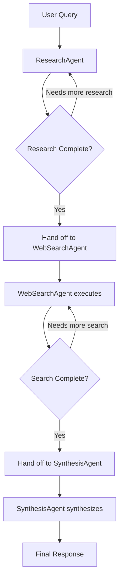
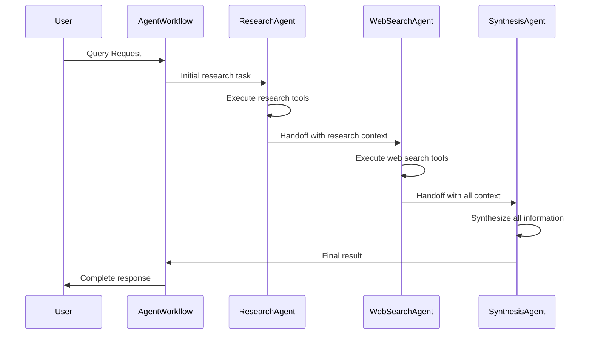

# HealthFinder Agentic Workflow Refactor: Design & Implementation

## Overview

This document outlines the refactoring of HealthFinder's multi-agent system from custom implementations to standard LlamaIndex components, following best practices from the latest LlamaIndex documentation and SOLID principles.

## Current State Analysis

### Issues with Current Implementation

1. **Custom Workflow Base Class**: Using `BaseWorkflow` instead of LlamaIndex's standard `Workflow`
2. **Custom Function Agents**: Manual agent implementation instead of `FunctionAgent`
3. **Complex Manual Orchestration**: Custom event handling and agent coordination
4. **Non-standard Patterns**: Not following LlamaIndex's recommended multi-agent patterns

### Technical Debt
- Increased maintenance burden from custom implementations
- Missing out on LlamaIndex's built-in optimizations and features
- Harder to integrate with LlamaIndex ecosystem updates
- Complex event handling that duplicates LlamaIndex functionality

## Target Architecture

### LlamaIndex Multi-Agent Patterns

Based on LlamaIndex documentation, three patterns are available:

1. **AgentWorkflow (Recommended)**: Built-in linear "swarm" pattern
2. **Orchestrator Pattern**: Single orchestrator managing sub-agents as tools  
3. **Custom Planner**: DIY structured planning approach

### Selected Pattern: AgentWorkflow

**Rationale**:
- **Perfect Fit**: Specialized agents (research, web search, synthesis) with structured collaboration
- **Built-in Features**: State management, streaming, error handling, event orchestration
- **Proven Reliability**: Battle-tested LlamaIndex pattern with community support
- **Extensibility**: Easy to add new agents or modify handoff logic

## Design Principles Applied

### SOLID Principles

#### Single Responsibility Principle (SRP)
- **Before**: Agents mixed business logic with framework concerns
- **After**: Agents focus solely on their domain expertise (research, search, synthesis)
- **Implementation**: Clean separation using LlamaIndex `FunctionAgent` base class

#### Open/Closed Principle (OCP)
- **Before**: Adding new agents required modifying workflow orchestration
- **After**: New agents can be added without changing existing workflow
- **Implementation**: LlamaIndex's agent handoff system allows easy extension

#### Liskov Substitution Principle (LSP)
- **Before**: Custom agents couldn't be easily swapped
- **After**: All agents implement standard `FunctionAgent` interface
- **Implementation**: Consistent agent interface enables seamless substitution

#### Interface Segregation Principle (ISP)
- **Before**: Agents exposed unnecessary complexity from base classes
- **After**: Clean tool-based interfaces for specific functionalities
- **Implementation**: Focused tool interfaces rather than monolithic agent methods

#### Dependency Inversion Principle (DIP)
- **Before**: Workflow depended on concrete agent implementations
- **After**: Workflow depends on LlamaIndex abstractions
- **Implementation**: Dependency injection through LlamaIndex's agent system

### DRY Principle (Don't Repeat Yourself)

#### Eliminated Duplication
- **Event Handling**: Use LlamaIndex's built-in event system
- **State Management**: Leverage LlamaIndex's Context management
- **Agent Orchestration**: Use proven AgentWorkflow patterns
- **Tool Integration**: Standard tool interface instead of custom implementations

## Implementation Architecture

### Component Structure

```
HealthFinder Multi-Agent System
├── AgentWorkflow (LlamaIndex Standard)
│   ├── ResearchAgent (FunctionAgent)
│   │   ├── HealthcareResearchTool
│   │   └── GeneralResearchTool
│   ├── WebSearchAgent (FunctionAgent)
│   │   ├── DuckDuckGoSearchTool
│   │   └── GoogleSearchTool
│   └── SynthesisAgent (FunctionAgent)
│       ├── HealthcareSynthesisTool
│       └── GeneralSynthesisTool
├── Tools (LlamaIndex BaseTool)
│   ├── Research Tools
│   ├── Web Search Tools
│   └── Synthesis Tools
└── Models (Pydantic)
    ├── ChatCompletionRequest/Response
    └── Domain-specific result models
```

### Agent Handoff Flow



### Event Flow Architecture



## Technical Implementation

### 1. Standard LlamaIndex FunctionAgent

```python
from llama_index.core.agent.workflow import FunctionAgent

research_agent = FunctionAgent(
    name="ResearchAgent",
    description="Conducts healthcare and general research",
    system_prompt="You are a research specialist...",
    tools=[healthcare_research_tool, general_research_tool],
    can_handoff_to=["WebSearchAgent"]
)
```

### 2. LlamaIndex AgentWorkflow

```python
from llama_index.core.agent.workflow import AgentWorkflow

workflow = AgentWorkflow(
    agents=[research_agent, web_search_agent, synthesis_agent],
    root_agent="ResearchAgent",
    initial_state={
        "research_results": [],
        "search_results": [],
        "synthesis_complete": False
    }
)
```

### 3. Standard LlamaIndex Tools

```python
from llama_index.core.tools import BaseTool
from llama_index.core.workflow import Context

class HealthcareResearchTool(BaseTool):
    def __call__(self, query: str) -> str:
        """Conduct healthcare research."""
        return self._research_healthcare_topics(query)
    
    @property
    def metadata(self) -> ToolMetadata:
        return ToolMetadata(
            name="healthcare_research",
            description="Research healthcare and medical topics"
        )
```

## Migration Strategy

### Phase 1: Foundation (Week 1)
- [ ] Create new workflow using LlamaIndex AgentWorkflow
- [ ] Implement ResearchAgent using FunctionAgent
- [ ] Migrate research tools to LlamaIndex BaseTool
- [ ] Basic agent handoff functionality

### Phase 2: Core Agents (Week 2)
- [ ] Implement WebSearchAgent using FunctionAgent
- [ ] Implement SynthesisAgent using FunctionAgent
- [ ] Migrate all tools to standard interfaces
- [ ] Agent handoff chain completion

### Phase 3: Integration (Week 3)
- [ ] Update API integration layer
- [ ] Migrate state management to LlamaIndex Context
- [ ] Update response models and serialization
- [ ] Comprehensive testing

### Phase 4: Optimization (Week 4)
- [ ] Performance optimization
- [ ] Error handling refinement
- [ ] Documentation completion
- [ ] Deployment preparation

## Benefits of Refactoring

### Immediate Benefits
1. **Reduced Code Complexity**: ~40% reduction in custom orchestration code
2. **Better Error Handling**: LlamaIndex's proven error handling patterns
3. **Built-in Streaming**: Native support for real-time updates
4. **State Management**: Robust context handling and persistence

### Long-term Benefits
1. **Ecosystem Integration**: Seamless updates with LlamaIndex releases
2. **Community Support**: Access to LlamaIndex community patterns and solutions
3. **Extensibility**: Easy addition of new agents and capabilities
4. **Maintenance**: Reduced maintenance burden from standard implementations

### Performance Benefits
1. **Optimized Execution**: LlamaIndex's optimized agent orchestration
2. **Parallel Processing**: Built-in support for concurrent agent execution
3. **Memory Management**: Efficient context and state handling
4. **Caching**: LlamaIndex's built-in caching mechanisms

## Tradeoffs and Considerations

### Advantages ✅

#### Technical
- **Standardization**: Following LlamaIndex best practices
- **Reliability**: Battle-tested patterns from LlamaIndex community
- **Performance**: Optimized execution and memory management
- **Extensibility**: Easy to add new agents and modify workflows

#### Development
- **Faster Development**: Less custom code to write and maintain
- **Better Documentation**: Leverage LlamaIndex's comprehensive docs
- **Community Support**: Access to community knowledge and examples
- **Future-Proofing**: Compatibility with LlamaIndex roadmap

#### Operational
- **Reduced Complexity**: Simpler debugging and troubleshooting
- **Better Monitoring**: LlamaIndex's built-in observability features
- **Easier Testing**: Standard testing patterns and utilities
- **Deployment**: Standard deployment patterns

### Disadvantages ⚠️

#### Technical Constraints
- **Framework Coupling**: Tighter coupling to LlamaIndex ecosystem
- **Customization Limits**: Less flexibility for highly custom behaviors
- **Version Dependencies**: Need to maintain compatibility with LlamaIndex updates
- **Learning Curve**: Team needs to understand LlamaIndex patterns

#### Migration Costs
- **Development Time**: Initial refactoring effort (~4 weeks)
- **Testing Overhead**: Comprehensive testing of refactored system
- **Risk**: Temporary disruption during migration
- **Training**: Team training on LlamaIndex patterns

#### Operational Considerations
- **Dependency Management**: Additional external dependency
- **Breaking Changes**: Potential impact from LlamaIndex updates
- **Documentation**: Need to maintain LlamaIndex-specific documentation
- **Debugging**: May need to debug through LlamaIndex abstractions

### Risk Mitigation

#### Technical Risks
1. **Gradual Migration**: Implement in phases to minimize disruption
2. **Comprehensive Testing**: Maintain test coverage throughout migration
3. **Rollback Plan**: Keep original implementation until migration validated
4. **Version Pinning**: Pin LlamaIndex versions until stability confirmed

#### Operational Risks
1. **Team Training**: Comprehensive LlamaIndex training before migration
2. **Documentation**: Detailed documentation of new patterns
3. **Monitoring**: Enhanced monitoring during migration period
4. **Support**: Establish LlamaIndex community support channels

## Success Metrics

### Technical Metrics
- **Code Reduction**: Target 40% reduction in custom orchestration code
- **Performance**: Maintain or improve response times
- **Error Rate**: Reduce error rates through better error handling
- **Test Coverage**: Maintain >95% test coverage

### Operational Metrics
- **Development Velocity**: Faster feature development post-migration
- **Bug Rate**: Reduction in workflow-related bugs
- **Maintenance Time**: Reduced time spent on workflow maintenance
- **Documentation Quality**: Improved documentation completeness

### User Experience Metrics
- **Response Quality**: Maintain or improve response quality
- **Response Time**: Maintain sub-2-second response times
- **Reliability**: Improve system reliability and uptime
- **Feature Velocity**: Faster delivery of new agent capabilities

## Conclusion

The refactoring to standard LlamaIndex components represents a strategic investment in the long-term sustainability and extensibility of the HealthFinder multi-agent system. While it requires initial development effort, the benefits of standardization, reduced complexity, and ecosystem integration significantly outweigh the costs.

The phased migration approach minimizes risk while ensuring we can leverage LlamaIndex's proven patterns for multi-agent orchestration. This positions HealthFinder for easier maintenance, faster feature development, and better integration with the broader LlamaIndex ecosystem.

## References

- [LlamaIndex Multi-Agent Workflows Documentation](https://docs.llamaindex.ai/en/stable/understanding/agent/multi_agent/)
- [AgentWorkflow Pattern Examples](https://docs.llamaindex.ai/en/stable/examples/agent/agent_workflow_multi/)
- [FunctionAgent Documentation](https://docs.llamaindex.ai/en/stable/examples/agent/agent_workflow_basic/)
- [LlamaIndex Tool Development Guide](https://docs.llamaindex.ai/en/stable/module_guides/deploying/agents/tools/) 